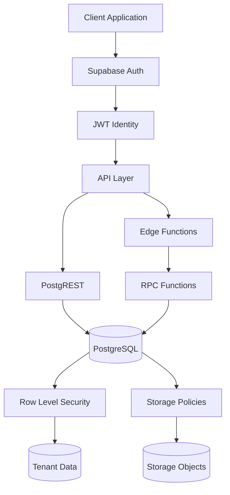

# Hi, I'm Ela 👋

I build structured backend systems with a focus on **Supabase architecture, security and maintainable PostgreSQL design**.

My work explores how Supabase applications are built, how authorization failures occur, and how they can be diagnosed and fixed.

---

## Focus

- Supabase backend architecture  
- Row Level Security (RLS) design and debugging  
- Edge → RPC workflows  
- Multi-tenant system design  
- PostgreSQL-first backend thinking  

---

## Supabase Backend Architecture (Typical Model)

## Selected Work
### Supabase Security Labs

Reproducible labs demonstrating common Supabase authorization failures and debugging workflows.

Topics include:

- RLS policy mistakes

- Edge Function authorization context

- service_role misuse

- Storage access control

- multi-tenant isolation

Repository:

➡ supabase-security-labs

### Supabase Patterns

Architecture patterns for building maintainable Supabase backends.

Includes:

- Edge → RPC architecture patterns

- RLS policy design patterns

- Supabase security checklists

- backend structure examples

Repository:

➡ supabase-patterns

### Principles

- Architecture first

- Security by default

- Controlled migrations

- Documentation as part of delivery

### Current

- **Little_Biker** — backend in progress

- **VibePep** — structured consulting site

📫 Contact: https://vibepep.com
